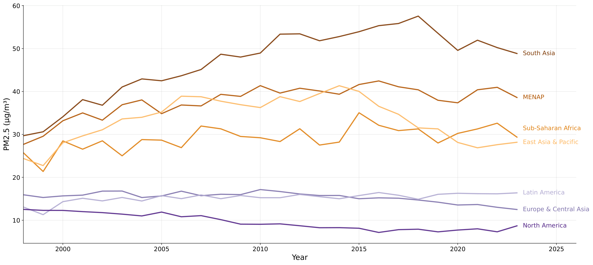
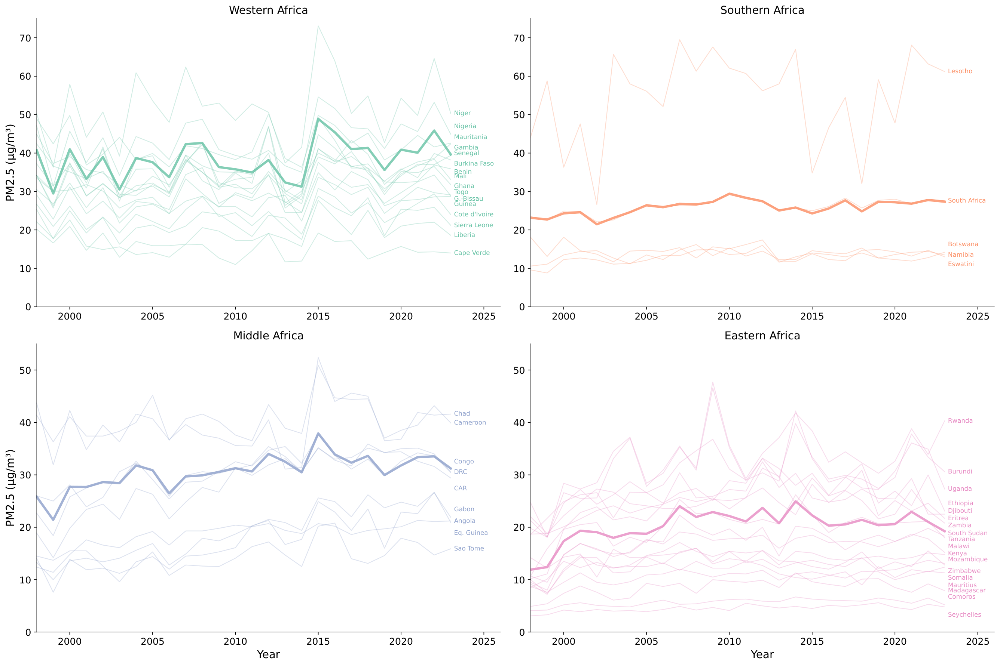
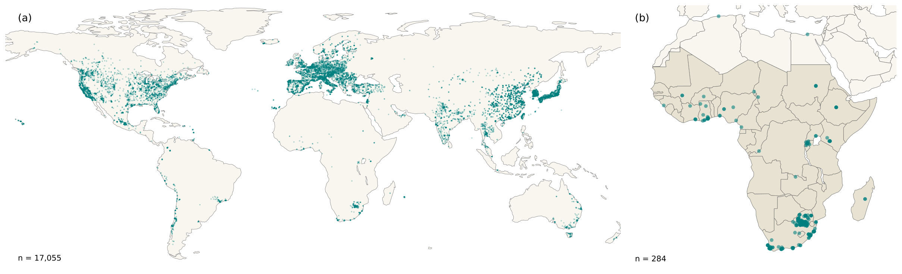

# Air Quality in Sub-Saharan Africa: Measurement Issues and Empirical Challenges

Emilia Tjernström (Macquarie University)

Author accepted manuscript, Annual Review of Resource Economics, Vol. 18 (2026). Not the version of record.
Citations appear as [@bibkey]; resolve them against references.bib in this bundle. See llms.txt for orientation.

Keywords: sub-Saharan Africa, air pollution, measurement error, particulate matter

# INTRODUCTION {#sec:intro}

Air pollution represents one of the most significant unpriced externalities in sub-Saharan Africa (SSA). Exposure to fine particulate matter (PM~2.5~) contributed to around 1.2 million deaths in Africa in 2021 [@healtheffectsinstituteStateGlobalAir2024]. [^1] Epidemiological evidence links long-term PM~2.5~ exposure to higher risks of cardiovascular disease, stroke, lung cancer, and chronic respiratory illness [@newellCardiorespiratoryHealthEffects2017; @cohenEstimates25yearTrends2017; @fisherAirPollutionDevelopment2021]; more recent work adds adverse birth outcomes to this list [@murrayGlobalBurden872020].

The costs extend well beyond health: even moderate air pollution exposure lowers labor productivity, weakens cognitive performance, and distorts decision-making in ways that hinder economic development [@aguilar-gomezThisAirNonhealth2022; @hoffmannUnequalEffectsPollution2024; @duncanImpactFineParticulate2025; @maImpactsContemporaneousAir2025]. The burden of air pollution falls disproportionately on the region's poor---of the 716 million people who both live on less than \$1.90 per day and face unsafe annual PM~2.5~, nearly 60 percent live in sub-Saharan Africa [@rentschlerGlobalAirPollution2023].

The pollution sources that drive PM~2.5~ in sub-Saharan Africa differ from those in both industrialized countries and other high-pollution developing regions [@mcduffieGlobalBurdenDisease2021]. Household combustion of solid fuels and kerosene is the dominant source across much of SSA [@fisherAirPollutionDevelopment2021].[^2] Saharan dust and crop burning add large but seasonally variable contributions, while vehicular exhaust, diesel generators, and open waste burning are growing sources in rapidly expanding cities [@chowdhuryGlobalReviewState2023; @farquharsonSustainabilityImplicationsElectricity2018; @gordonEffectsTrashResidential2023; @mcduffieGlobalBurdenDisease2021]. As a result, many areas without industrial activity still face high PM~2.5~ exposure. The resulting mix varies with rainfall, wind patterns, and agricultural cycles, which makes it harder to attribute pollution to specific sources and complicates both policy design and empirical identification.

The region was long viewed as relatively unaffected by air pollution---perhaps precisely because it lacks the heavy industry, coal-fired power, and dense urbanization associated with air quality crises in South and East Asia. As a result, neither domestic governments nor the global development community have invested heavily in monitoring infrastructure [@bililignEastAfricanMegacity2024; @healtheffectsinstituteStateAirQuality2022], and very few countries in the region have any legislated ambient air quality standards [@unitednationsenvironmentprogrammeRegulatingAirQuality2021]. This has shaped the data environment in ways that constrain both research and policy [@amegahUrbanAirPollution2017; @meadSpotlightAirPollution2023]. Monitoring infrastructure is not merely a measurement issue: @jhaUSEmbassyAirquality2022 find that public data dissemination from the installation of US Embassy air-quality monitors in developing-country cities reduced PM~2.5~ by 2--4 $\mu$g/m^3^, likely by making local pollution levels salient and spurring policy responses.

Sub-Saharan Africa's pollution trajectory diverges from other developing regions: while East Asia and South Asia have reduced PM~2.5~ levels in recent years, African population-weighted exposures are creeping upward. **Figure [1](#fig:trends_regional){reference-type="ref" reference="fig:trends_regional"}** shows population-weighted PM~2.5~ by World Bank region over 1998--2023, using data from @shenEnhancingGlobalEstimation2024. Sub-Saharan Africa's PM~2.5~ concentrations have risen from around $25\mu$g/m^3^ in 1998 to around $30\mu$g/m^3^ in 2023, roughly six times the WHO annual guideline of $5\mu$g/m^3^ [@WHOGlobalAir2021].

<figure id="fig:trends_regional">

 <em>Source:</em> ; population weights from the Gridded Population of the World v4 (GPWv4). Each line shows a regional population-weighted average, weighting each country’s PM2.5 by its share of regional population.

<figcaption>Population-weighted annual PM2.5 by World Bank region, 1998–2023</figcaption>
</figure>

As **Figure [2](#fig:trends_ssa){reference-type="ref" reference="fig:trends_ssa"}** shows, the regional average hides substantial sub-regional and country-level heterogeneity. Western Africa faces the highest concentrations: several countries face pollution comparable to South Asia and the Middle East, with Niger's annual averages frequently exceeding $50\mu$g/m^3^. Southern Africa is much cleaner on average, averaging below $25\mu$g/m^3^, but Lesotho is an outlier with levels often in excess of $50\mu$g/m^3^. Eastern Africa's PM~2.5~ levels increased early in the period, but have since stabilized around $20\mu$g/m^3^, though the variation within the region is stark. Middle Africa tracks the regional average most closely.

<figure id="fig:trends_ssa">

 <em>Source:</em> . Sub-Saharan African countries grouped by UN M49 Region Codes . Thin lines represent individual countries and bold lines show sub-regional population-weighted averages. Labels appear at each country’s final data point. Sudan is excluded because the UN M49 standard classifies it as Northern Africa.

<figcaption>Population-weighted PM2.5 in sub-Saharan Africa by sub-region, 1998–2023</figcaption>
</figure>

The challenge of air pollution in sub-Saharan Africa is compounded by the scarcity and structure of the data available to measure it. While high-income countries use dense ground-based monitoring networks to inform policy, the vast majority of sub-Saharan African nations lack a single reference-grade monitor (see **Figure [3](#fig:monitors){reference-type="ref" reference="fig:monitors"}**). Africa averages just 0.03 PM~2.5~ monitors per million inhabitants, and the population-weighted distance to the nearest monitor is roughly 500 km [@martinNoOneKnows2019]. As a consequence, most evidence on PM~2.5~ levels and trends comes from satellite- and model-based hybrid products rather than dense ground networks of high-quality monitors. The reliance on these data sources introduces measurement error that is often non-classical and spatially structured in ways that can bias empirical estimates.

{#fig:monitors width="\\linewidth"}

This review aims to provide guidance for applied economists with an interest in studying air quality in sub-Saharan Africa. I first outline the measurement processes that underlie the most commonly used data sources, their biases and limitations, and clarify the implications for empirical research designs. I then review existing empirical estimates of pollution's effects on health, agriculture, and human capital through the lens of this measurement environment, identifying where non-classical error structures interact with identification strategies in ways that may affect the interpretation of existing results.

# DATA AND MEASUREMENT {#sec:data}

Air quality data in SSA fall into two broad categories. Ground-based instruments measure pollution directly but are sparse and unevenly distributed. Among these, reference-grade monitors provide the most reliable measurements, while low-cost sensors expand spatial coverage at the expense of accuracy. Model-based products fill the spatial gaps, but introduce measurement error whose structure depends on the product's design and the local environment. These error structures shape what empirical designs can credibly identify. Below, I present a simple framework to structure our discussion of how measurement error in different data types likely affects empirical estimates. I then review the most common data products through this lens.

## A Framework for Exposure Measurement Error {#subsec:measurement_error}

Assume that we want to estimate the effect of pollution exposure on an outcome $Y_{it}$: $$\begin{align}
    Y_{it} &= \beta X_{it}^* + \mathbf{Z}_{it}'\gamma + \varepsilon_{it}, \label{eq:true}
\end{align}$$ where $X_{it}^*$ is the true PM~2.5~ exposure for unit $i$ at time $t$ and $\mathbf{Z}_{it}$ is a vector of controls. However, we do not observe true pollution exposure. Instead, our data measure exposure with error: $X_{it} = X_{it}^* + \eta_{it}$, where $\eta_{it}$ is measurement error. Rewriting [\[eq:true\]](#eq:true){reference-type="eqref" reference="eq:true"} in terms of observed exposure makes $\eta_{it}$ part of the composite error, so OLS will generally be biased. The direction and magnitude of the resulting bias depends on how $\eta$ relates to $X^*$, $\mathbf{Z}$, and $\varepsilon$.[^3]

The simplest case is classical measurement error, where $\eta$ is independent of both $X^*$ and $\varepsilon$. OLS then yields: $$\begin{align}
    \text{plim}\; \hat{\beta}_{\text{OLS}} &= \beta \cdot \underbrace{\frac{\sigma^2_{X^*}}{\sigma^2_{X^*} + \sigma^2_{\eta}}}_{\lambda}, \label{eq:classical}
\end{align}$$ where our estimate is attenuated by the reliability ratio, $\lambda$ [@fuller1987measurement]. This benchmark is useful but, as we will see, the classical assumptions are unlikely to hold for pollution data in SSA.[^4]

Maintaining the assumption that true exposure is exogenous (i.e., $\text{Cov}(X^*, \varepsilon) = 0$) but allowing $\eta$ to correlate with true exposure or with the structural error, we instead get: $$\begin{align}
\text{plim}\; \hat{\beta}_{\text{OLS}}
&= \beta \cdot \frac{\sigma^2_{X^*} + \text{Cov}(\eta, X^*)}{\sigma^2_{X^*} + \sigma^2_{\eta} + 2\,\text{Cov}(\eta, X^*)} + \frac{\text{Cov}(\eta, \varepsilon)}{\sigma^2_{X^*} + \sigma^2_{\eta} + 2\,\text{Cov}(\eta, X^*)} \nonumber \\
&= \beta \cdot \underbrace{\frac{\text{Cov}(X, X^*)}{\text{Var}(X)}}_{\lambda^*} + \frac{\text{Cov}(\eta, \varepsilon)}{\text{Var}(X)}. \label{eq:nonclassical}
\end{align}$$ The bias decomposes into a multiplicative factor, $\lambda^*$, and an additive term driven by $\text{Cov}(\eta, \varepsilon)$. $\lambda^*$ captures how variation in observed exposure maps into true exposure. Unlike the classical reliability ratio, $\lambda^*$ depends on both noise variance and $\operatorname{Cov}(\eta, X^*)$, and need not lie between zero and one. In practice, $\text{Cov}(\eta, X^*) \neq 0$ whenever measurement error varies with true pollution levels---for example, if satellite retrievals systematically overstate concentrations in clean areas and understate them in polluted areas.

The second term captures the endogeneity that arises from having $\eta$ in the composite error term. If $\eta$ correlates with unobserved determinants of the outcome, this term can reinforce or offset attenuation, independently of $\lambda^*$. For example, satellite-derived pollution estimates may systematically understate exposure in dense informal urban areas, where complex surface conditions degrade retrieval accuracy. If residents of these areas also face worse outcomes for reasons we cannot fully control for, then $\eta$ and $\varepsilon$ covary and this term biases our estimates.

For studies linking pollution to health, $\text{Cov}(\eta, \varepsilon)$ could be non-zero even if ambient concentrations were measured perfectly, because they are only a proxy for personal exposure. This review focuses on outdoor PM~2.5~, but health outcomes depend on the total dose that a person inhales, which includes indoor exposure from cooking with solid fuels [@fisherAirPollutionDevelopment2021]. This can be a significant source of bias in SSA, since household combustion of solid fuels is an important source [see @jeulandEconomicsHouseholdAir2015a for a comprehensive treatment of household air pollution]. When researchers use outdoor PM~2.5~ to proxy for total exposure, $\eta$ includes the indoor-outdoor differential, which correlates with cooking fuel, housing quality, and income---all independent predictors of health outcomes.

The bivariate notation in Equation [\[eq:nonclassical\]](#eq:nonclassical){reference-type="ref" reference="eq:nonclassical"} obscures two important ways in which measurement error interacts with covariates and co-pollutants. First, converting satellite signals or model outputs to pollution estimates can introduce spatially varying bias---especially where ground data for calibration are scarce.[^5] If measurement error covaries with observables (i.e., $\text{Cov}(\eta_{it}, \mathbf{Z}_{it}) \neq 0$), then partialling out those controls---for example, by controlling for geographic or climatic variables that also predict measurement accuracy---can change both the effective noise-to-signal ratio and the residualized covariance structure, making it difficult to sign the direction of bias without further assumptions.[^6] Second, controlling for co-pollutants using noisy proxies creates a distinct problem: measurement error in one pollutant's proxy can bias the coefficient on another---even one that is measured without error. @klugerBiasesEstimatesAir2024 show that when pollutants are positively correlated and all have a non-positive effect on the outcome, measurement error in one proxy biases estimates of the others away from zero.[^7]

Another error structure, called Berkson error [@berkson1950there; @carrollMeasurementErrorNonlinear2006], arises when researchers assign gridded pollution values to survey respondents, for example when matching DHS clusters or LSMS households to gridded pollution measures. This approach assigns all individuals in grid cell $c$ to a single pollution value, $X_c$, but the true individual exposure $X_i^*$ varies within the cell: $$\begin{align}
    X_i^* &= X_c + u_i, \label{eq:berkson}
\end{align}$$ where $u_i$ captures within-cell deviations. Unlike the error structures in Equations [\[eq:classical\]](#eq:classical){reference-type="ref" reference="eq:classical"}--[\[eq:nonclassical\]](#eq:nonclassical){reference-type="ref" reference="eq:nonclassical"}, the observed value $X_c$ is now the conditional mean, and true exposure varies around it. If within-cell deviations are independent of the cell mean ($u \perp X_c$), Berkson error does not bias the OLS slope coefficient in a linear model, though it increases residual variance [@carrollMeasurementErrorNonlinear2006].[^8] This no-bias result breaks down in nonlinear models: when the dose-response function is concave, Berkson error flattens the estimated curve, and under heterogeneous treatment effects, the bias depends on the joint distribution of exposure and effect heterogeneity [@carrollMeasurementErrorNonlinear2006; @blundellEstimationHeterogeneousDemand2022]. In practice, the error in gridded products is rarely pure Berkson. @szpiroEfficientMeasurementError2011 show that predicted exposures combine a Berkson component with a "classical-like" component, and that the latter can bias OLS [see also @sheppardConfoundingExposureMeasurement2012].[^9]

Beyond the structure of the error itself, estimation choices shape which components of it survive into the identifying variation. Location and time fixed effects, in particular, can either help or hurt, depending on which component of the error they absorb. We can decompose $\eta_{it}$ into location-specific, period-specific, and residual components: $$\begin{align}
    \eta_{it} &= \bar{\eta}_i + \bar{\eta}_{\cdot t} + \tilde{\eta}_{it},
    \label{eq:fe_decomp}
\end{align}$$ where $\bar{\eta}_i$ and $\bar{\eta}_{\cdot t}$ are absorbed by location and time fixed effects, respectively. If the non-classical correlation between $\eta$ and $X^*$ is primarily spatial---for example, because satellite retrieval accuracy varies across locations but is stable over time---location fixed effects absorb $\bar{\eta}_i$ and eliminate the bias from that correlation. But fixed effects also remove the corresponding persistent components of true exposure, leaving identification to rest on within-unit, within-period variation in $X_{it}$, where the residual error $\tilde{\eta}_{it}$ can account for a large share of the remaining signal. As @grilichesErrorsVariablesPanel1986 show, this can worsen the noise-to-signal ratio, so the net effect of fixed effects on total bias is ambiguous. Temporal aggregation compounds the residual problem, because averaging over time smooths precisely the within-unit variation that identification relies on.

The residual $\tilde{\eta}_{it}$ creates another problem when the identifying variation itself changes the particle mix that sensors or models are measuring. Many pollution data products measure different particle types with different biases (Sections [2.2.2](#subsec:low-cost){reference-type="ref" reference="subsec:low-cost"}--[2.3.2](#subsec:re-analysis){reference-type="ref" reference="subsec:re-analysis"}). If the shock or instrument that a researcher exploits also changes the particle mix, $\eta_{it}$ shifts at the same time as $X_{it}^*$, generating $\text{Cov}(\tilde{\eta}_{it}, \tilde{X}^*_{it}) \neq 0$ in precisely the residual variation that fixed effects leave for identification. For example, a researcher using COVID-19 lockdowns as a temporal shock to estimate the effect of pollution on a health outcome would face this problem: lockdowns reduce traffic emissions while leaving household cooking emissions largely unchanged, shifting aerosol composition and with it the measurement error properties of the exposure data.

The same logic applies to instrumental-variable strategies. @deryuginaMortalityMedicalCosts2019 use wind direction to instrument for daily PM~2.5~ and estimate its effect on elderly mortality in the US. Adapting this approach to SSA is complicated by the fact that wind direction also determines aerosol composition: northerly Harmattan winds carry mineral dust, while other wind patterns leave locally generated traffic and biomass aerosols dominant. If wind direction predicts measurement error, IV no longer solves the problem it was designed to fix.

The next section reviews common data products, considering the error structures that each introduces and the implications for estimation and interpretation.

## Ground-Based Measurements {#subsec:ground}

Ground-based instruments sample air at a fixed location and measure pollutant concentrations on site. They span two classes that trade accuracy against cost and coverage: reference-grade monitors and low-cost sensors.

### Reference Monitors {#subsec:reference}

Reference-grade air quality monitors provide direct measurements of air pollutants using methods that meet regulatory standards for accuracy and precision. These instruments are used to establish air quality standards for compliance purposes and serve as ground truth for validating other measurement methods. However, they require stable power, technical expertise for calibration and maintenance, and a reliable supply chain for replacement parts.

These infrastructure barriers may help explain why sub-Saharan Africa has an extremely small fraction of the world's reference monitors. **Figure [3](#fig:monitors){reference-type="ref" reference="fig:monitors"}** maps the global distribution of reference-grade monitors compiled from three publicly accessible sources: the [OpenAQ platform](https://explore.openaq.org/), [AirQo](https://analytics.airqo.net/), and the [World Air Quality Index Project (AQICN)](https://aqicn.org/api/). Of over 17,000 reference monitors worldwide, only 285 (1.7%) are in sub-Saharan Africa, and South Africa accounts for around 230 of these. These counts include inactive sites, so they represent an upper bound on functional monitoring capacity. Data availability has deteriorated in recent years due to two main events: in March 2024, South Africa's national monitoring network stopped sharing data through OpenAQ. A year later, in March 2025, the U.S. State Department's embassy monitoring network ceased public data sharing [@associatedpressUSStopsSharing2025]. Embassy monitors had been among the few sources of openly accessible, reference-grade air quality data in SSA. After these two events, only 15 monitors on OpenAQ have shared data, with only one monitor on OpenAQ reporting data during the first quarter of 2026.

Among the operational PM~2.5~ monitors in SSA on OpenAQ, the data that do exist are sparse. I define completeness as the share of potential hours with a recorded observation, measured from a monitor's first observation through its last, over a ten-year window (April 2016 to April 2026).[^10] Median completeness across SSA PM~2.5~ monitors is just 37%, meaning that the typical monitor has publicly accessible data for roughly one-third of its potential hours. Fewer than a third of monitors reach 50% completeness, and 30% have data for less than 25% of potential hours. Additional reference-grade monitoring efforts operate in the region, but data availability varies and most are not shared through centralized platforms.[^11] The [EPIC Air Quality Fund](https://epic.uchicago.edu/area-of-focus/epic-air-quality-fund/) is funding new reference monitors and expects their grantees to share data, which may improve coverage going forward.

This scarcity leaves SSA without both the regulatory foundation to set air quality standards and without the calibration baseline to validate alternative measurements. Absent a reference monitor network, researchers studying air quality in SSA have to rely on the alternatives discussed below: low-cost sensors for direct measurement, or gridded products derived from some combination of models and satellites. Each involves trade-offs between measurement quality, spatial coverage, and the potential for systematic bias, all of which are amplified by the lack of reference monitors for calibration and validation.

### Low-Cost Sensors (LCS) {#subsec:low-cost}

Low-cost sensors (LCS) have emerged as a potential response to these data gaps, providing hyper-local and real-time particulate matter data at a fraction of the cost of reference-grade monitors. These sensors infer PM~2.5~ by shining light through a small chamber, measuring how strongly particles scatter that light, and converting this into a particulate matter estimate using an internal, often proprietary, formula.[^12] The optical approach comes with inherent limitations: sensor performance is sensitive to humidity as well as the size distribution and composition of the sampled aerosols [@ouimetteCorrectingNephelometerbasedPM2024]. In addition, data quality can degrade over time [@desouzaAnalysisDegradationLowcost2023] and accuracy depends on whether the local particle mix resembles the conditions under which the manufacturer calibrated the device [@molinaruedaSizeResolvedFieldPerformance2023]. For example, if a LCS is calibrated in a city where vehicle exhaust is the primary aerosol but deployed in an area with significant windblown dust or biomass smoke, the manufacturer's correction factors may fail [@malingsFineParticleMass2020; @molinaruedaSizeResolvedFieldPerformance2023].

The most relevant biases for SSA are those related to particle size and humidity. Field evaluations of common LCSs have found that they severely underestimate PM~2.5~ during windblown dust episodes, which is particularly problematic for SSA, where dust is often a major pollution source [@molinaruedaSizeResolvedFieldPerformance2023; @ouimetteCorrectingNephelometerbasedPM2024].[^13] Humidity is also problematic, since many particles absorb water in humid air, swell, and therefore scatter more light, which leads to overestimation of particulate matter concentrations.[^14] A collocation study in Accra quantified both biases in an SSA setting: @nimoLowCostPM25Sensor2025 find that mean absolute errors during the Harmattan dry season are roughly five times larger than in the wet season (MAE of 20--29 vs. 2--10 $\mu$g/m$^3$), with dust-driven underestimation dominating dry-season errors and humidity-driven overestimation dominating during the wet seasons.

Despite these limitations, LCSs can provide useful data if researchers follow careful calibration protocols. Properly calibrated LCSs can achieve reasonably high correlations with reference instruments, with $R^2$ of 0.8-0.9 quite common (see e.g., @rahejaLowCostSensorPerformance2023). Ideally, LCSs should be collocated with a reference-grade monitor before they are deployed to study sites, using collocation data to evaluate sensor performance and to develop calibration models (see e.g., @giordanoLowcostSensorsHighquality2021).[^15] In the absence of a reference monitor, @bagkisEvolvingTrendsApplication2025 describe two alternative approaches. The first, called proxy-based field calibration, treats one or more better-tested sensors as benchmarks and calibrates remaining sensors to match them using collocation periods and corrections. The second, transfer-based field calibration, applies a calibration relationship from a different site or time, with adjustments as needed for the current context.

These calibration requirements raise the actual cost of deploying LCSs beyond the purchase price of the devices. Reference collocation requires installation labor and a nearby reference monitor, and the alternative approaches demand additional sensors, field time, or rely on the assumption that calibration relationships transfer across sites. LCSs also have short operational lifespans compared to reference monitors (see e.g., @desouzaAnalysisDegradationLowcost2023), which adds to the cost of any longer-term study.

Calibration introduces a secondary data-generating process: the corrected measurements depend on model specification, training period selection, and algorithm choice, so researchers should test the sensitivity of their results to these calibration decisions. Imperfect humidity correction is particularly concerning for identification and residual calibration error will likely be largest in humid periods and locations. If humidity also independently affects the outcome---for example, through respiratory function, disease transmission, or crop growth---then the measurement error correlates with unobserved determinants of the outcome ($\text{Cov}(\eta, \varepsilon) \neq 0$ in Equation [\[eq:nonclassical\]](#eq:nonclassical){reference-type="ref" reference="eq:nonclassical"}), and the resulting bias can push estimates in either direction.

Additionally, the measurement limitations of LCSs can introduce threats to identification for randomized controlled trials (RCTs) that use LCSs to collect outcome data. If treatment affects an area's aerosol levels or particle composition (e.g., dust versus biomass smoke or traffic-related soot), it can also change how the LCS responds to a given true PM concentration. Treatment could also change the rate at which sensors degrade, for example through differential dust deposition or smoke residue. These issues all lead to non-classical measurement error (Equation [\[eq:nonclassical\]](#eq:nonclassical){reference-type="ref" reference="eq:nonclassical"}), with sensor drift and bias both potentially differing by treatment status.

Periodic re-collocation with a reference instrument can detect drift before it contaminates results. If study resources prohibit this, another approach is to rotate sensors across treatment and control sites on a fixed schedule. Device fixed effects then absorb each sensor's average bias, while the rotation prevents the time-varying component of drift from correlating with treatment status. These steps do not eliminate measurement error, but they reduce the chances that it will be correlated with treatment status.

## Model-Based Data Products {#subsec:model-based}

Model-based data products estimate PM~2.5~ concentrations using models of the atmosphere to represent how pollution is emitted, transported, and removed from the air. They underpin most global PM~2.5~ datasets that economists use. Chemical transport models (CTMs) use emissions inventories and weather data to simulate pollution on a 3D grid. Reanalysis systems combine a forecasting model with available observations to produce a gridded dataset that is consistent across time and space. Hybrid models use combinations of CTM simulation and reanalysis outputs and satellite-based estimates as inputs into a statistical or, increasingly, a machine-learning model that is trained on ground monitor data. They then use the fitted relationships to extrapolate pollution estimates globally and over time.

### Chemical-Transport Models (CTMs) {#subsec:ctm}

CTMs simulate pollution on a 3D grid at fine time scales. They combine emissions inventories (databases of how much pollution each source type emits, where, and when) for different sources, such as traffic, industry, household fuel use, biomass burning, dust, and sea-salt, with weather data such as wind, temperature, and rainfall. The model then applies a large system of physics and chemistry equations that describe how pollution moves, changes, and leaves the atmosphere. Where ground monitors exist, CTMs mostly use them to evaluate or tune the model, rather than as direct inputs. GEOS-Chem, a widely used CTM, simulates how pollutants move with the wind, mix in the atmosphere, and get removed [@beyGlobalModelingTropospheric2001]. As we will see below, GEOS-Chem also feeds into several global PM~2.5~ products that economists and public health researchers use.

One common use of CTMs is to support counterfactual simulations. For example, @parkAttributingHumanMortality2024 feed fire emissions estimates into GEOS-Chem to simulate yearly surface PM~2.5~ concentrations under both observed historical climate and counterfactual "no-climate-change" scenarios, attributing estimated mortality differences to climate-change-driven fire activity.

For applied microeconomics research, it is important to remember that CTM outputs are modelled concentrations, not measurements. In sub-Saharan Africa, CTMs face important constraints: emissions inventories often rely heavily on proxies, such as fuel use or population counts, instead of direct data on activities like burning or industrial activity. Because these proxies are themselves economic variables, CTM errors are likely correlated with economic activity, generating non-classical measurement error (Equation [\[eq:nonclassical\]](#eq:nonclassical){reference-type="ref" reference="eq:nonclassical"}). Sparse ground monitoring compounds the problem, since model validation may be unable to detect or correct these biases. A recent global study of GEOS-Chem [@zhangAdvancesSimulatingGlobal2023b] confirms that coarse global simulations understate population exposures and misstate which sectors and locations drive the highest concentrations, with especially large discrepancies in the Global South.

### Reanalysis Datasets {#subsec:re-analysis}

Reanalysis datasets combine a numerical weather model with many different observations using what is called "data assimilation" to create a best-guess estimate of the atmosphere over time and space. At each time step, these models start from a recent forecast and adjust it, nudging it toward existing data, including surface stations and satellite measurements. When ground-based observations are sparse, like most of SSA, these models rely more heavily on the model and on satellites, so the uncertainty and potential biases are greater.

Most reanalyses focus on weather variables such as wind, temperature, and humidity, but some also include pollution concentrations. The two most relevant are NASA's MERRA-2 [@randlesMERRA2AerosolReanalysis2017; @gelaroModernEraRetrospectiveAnalysis2017] and ECMWF's CAMS-RA [@innessCAMSReanalysisAtmospheric2019]. MERRA-2 provides estimates of particulate matter, broken down into five components (dust, black carbon, organic carbon, sea salt, and sulfate), at 0.5° × 0.625°, or around 50 km, resolution from 1980 onward. CAMS-RA covers a shorter period, January 2003 to December 2024 at the time of writing, at 0.75° × 0.75° (roughly 80 km) with three-hourly temporal resolution, but instead tracks a wider range of pollutants: in addition to particulate matter, it includes ozone, NO~2~, SO~2~, and CO. CAMS also provides forecasts for the same variables at a finer spatial resolution (0.4° × 0.4°, or roughly 45 km). MERRA-2 was designed primarily to represent dust and smoke aerosols and their role in the climate system, while CAMS-RA places more emphasis on urban and industrial pollutants of the kind that European regulatory networks track.

Validation studies suggest that reanalysis products track pollution variation reasonably well on average, but this average masks substantial region-specific biases. Using data from Indian cities, @navinyaEvaluationPM25Surface2020 show that MERRA-2's monthly averages are correlated with regulatory monitors ($\rho = 0.96$), but underestimate annual average PM~2.5~ by nearly 30 $\mu \text{g}/m^3$ (34%). Further, while regulatory monitors recorded pollution above India's national standard on 34% of days, MERRA-2 only flagged 11% of those days. In SSA, performance is worse: @giordanoUtilizingReanalysisDatasets2024 compare MERRA-2 to reference monitor readings and find that the product explains very little of the PM~2.5~ variation in Kenya and South Africa ($R^2<0.1$). In Ghana, it attributes most particulate matter to dust in all seasons, even though Saharan dust is only a major source during parts of the year. In Niamey, @gualtieriPotentialLowcostPM2024 compare calibrated low-cost sensors against CAMS forecasts and find that they overestimate PM~2.5~ and underestimate PM~10~, with substantial seasonal heterogeneity in the amount of measurement error.

Mapping these findings back to Equation [\[eq:nonclassical\]](#eq:nonclassical){reference-type="ref" reference="eq:nonclassical"}, reanalysis products can have different biases in different regions and over time. This means that researchers cannot rely on validation results from one setting to sign the bias in another, and that panel designs should pay careful attention to how fixed effects interact with the error structure. A stable level shift ($\bar{\eta}_i$ in Equation [\[eq:fe_decomp\]](#eq:fe_decomp){reference-type="ref" reference="eq:fe_decomp"}) would be absorbed by location fixed effects. The Ghana and Niamey evidence, however, suggests that reanalysis errors also vary systematically with seasons; in a location fixed effects design, this bias would enter through $\tilde{\eta}_{it}$ and remain in the error term, potentially confounding estimates if it correlates with outcomes or treatments under study.

### Satellite-Based Geophysical Products {#subsec:satdata}

Satellite instruments retrieve column aerosol optical depth (AOD), which captures how much sunlight is scattered and absorbed by particles in the atmospheric column, i.e., between the top of the atmosphere and the Earth's surface. The most commonly used AOD retrievals come from NASA's MODIS instruments, available since 2000. MAIAC, a widely-used retrieval algorithm applied to MODIS data, produces AOD estimates at 1 km resolution. Geophysical products convert AOD into surface PM~2.5~ estimates based on models (often CTMs) that specify how much of the column mass sits near the ground and how particle size and humidity affect the AOD-PM relationship.

Most AOD retrievals share two systematic problems: non-random missingness and retrieval bias. Satellite AOD retrieval requires a clear view of the surface, so the algorithms discard observations where clouds or snow interfere. This removes a large share of daily observations---about 90% in MAIAC---and the missing days tend to be higher-pollution, because aerosols absorb water and scatter more light under the humid conditions that generate clouds [@biImpactsSnowCloud2019]. Among retrievals that do succeed, MAIAC tends to overestimate AOD in clean conditions and underestimate it during dusty conditions, because its assumptions break down when mineral dust dominates [@rogozovskyImpactDifferentAerosol2023].

Both of these issues matter for empirical designs that rely on day-to-day variation as the non-random missingness removes the high-pollution tail of the exposure distribution and thus reduces the available identifying variation. The retrieval bias introduces a non-classical component (as in Equation [\[eq:nonclassical\]](#eq:nonclassical){reference-type="ref" reference="eq:nonclassical"}), since the measurement error varies systematically with the true pollution level---overestimating in clean conditions and underestimating in dusty ones implies $\text{Cov}(\eta, X^*) < 0$. When this negative covariance is large enough, $\lambda^*$ in Equation [\[eq:nonclassical\]](#eq:nonclassical){reference-type="ref" reference="eq:nonclassical"} can exceed one, meaning that the multiplicative bias amplifies rather than attenuates the true effect. If, in addition, cloudiness affects the outcome independently---through channels such as rainfall, temperature, or activity patterns---dropping cloudy days may introduce sample selection that could bias estimates in either direction. While few economists work with raw AOD directly, the hybrid products we discuss next use satellite data as inputs and the biases can persist even in corrected estimates, especially in monitor-sparse regions.

### Hybrid Products {#subsec:hybrids}

Hybrid products combine some or all of these ingredients---ground monitor data, CTM or reanalysis output, and satellite-derived estimates---to predict PM~2.5~ concentrations on a global grid using statistical or machine-learning models. The @vandonkelaarGlobalEstimatesFine2016a study is a leading example and the resulting dataset one of the most commonly used for global PM~2.5~ studies. First, they combine satellite AOD with GEOS-Chem output to build a global prior of annual PM~2.5~. They then use a geographically weighted regression of the bias (ground monitor PM~2.5~ minus the prior), using data from around 10,000 monitors worldwide, on a small set of covariates, including indicators of aerosol type and land use, with location-varying coefficients.[^16]

The resulting global PM~2.5~ surface agrees closely with monitors where they exist, but the correction is likely weaker far from calibration data. In SSA, where @vandonkelaarGlobalEstimatesFine2016a report zero or very few monitors contributing to the GWR, the correction relies heavily on the aerosol-type and land-use covariates, which in turn inherit uncertainty from CTMs (Section [2.3.1](#subsec:ctm){reference-type="ref" reference="subsec:ctm"}).

More recent work extends this approach using deep learning methods. @shenEnhancingGlobalEstimation2024 build a convolutional neural network that takes existing estimates as a prior (instead of learning PM~2.5~ from scratch), and learns their local bias relative to monitors. The authors then use a loss function that penalizes large deviations from this prior, so in places with few or no monitors it stays close to the physical prior instead of extrapolating freely from monitors in other regions. This design reduces the risk of unrealistic values far from monitors, which has been a common issue with earlier approaches. Their PM~2.5~ estimates, released as dataset version [V6.GL.02.04](https://www.satpm.org/v6-gl-02-04), are available monthly from 1998--2023 at 0.01° × 0.01°(equivalent to about 1.1 kilometer at the equator) and show substantially better out-of-sample fit in cross-validation than earlier approaches, especially in monitor-sparse regions.

A recent application of these methods in West Africa illustrates both their promise and their constraints for applied work [@westerveltTwentyYearsHigh2025]. They construct a daily, $1 \times 1$ km gridded PM~2.5~ dataset spanning 2005--2024 for West Africa by training several machine-learning models using data from ground-based reference monitors located on 10 US embassies, satellite measures of gases that form or travel with PM~2.5~, as well as land meteorology from ERA5, a global atmospheric reanalysis produced by the European Centre for Medium-Range Weather Forecasts. Their preferred model, based on out-of-sample performance metrics, fits their urban training sites well, with an $R^2$ of around 0.9. The resulting data reveal very high exposures and strong Harmattan-season peaks across West Africa. Since the model is primarily training on data from ten urban centers, measurement error likely grows in rural areas without local training data and in places with very different emissions composition that differ from these sites. Even within these urban areas, US Embassy compounds may not be representative of the exposure patterns in other parts of the city.

While the latest hybrid models perform well in cross-validation, they degrade away from their training data. Evidence from the US illustrates the problem: @sullivanUsingSatelliteData2018 find substantial bias in globally calibrated PM~2.5~ models even where regional calibration performs well, and @fowlieBringingSatelliteBasedAir2019 show that satellite estimates diverge sharply from co-located monitors, with prediction errors that are spatially heterogeneous and biased downward at higher concentrations. In SSA, where monitoring is concentrated in very few urban sites, the problem is likely worse, especially in rural areas where the model falls back on priors. If these rural areas also have systematically different true PM~2.5~ levels, the prediction error correlates with true exposure, generating $\text{Cov}(\eta, X^*) \neq 0$ in Equation [\[eq:nonclassical\]](#eq:nonclassical){reference-type="ref" reference="eq:nonclassical"}.

### Model Uncertainty {#subsec:uncertainty}

Model-based data products offer broad spatial and temporal coverage in SSA, filling an important gap where ground-based data remain scarce. However, they all embed significant uncertainty: CTMs and reanalyses inherit uncertainty from the proxies used in emissions inventories (fuel sales, population, land cover) when direct activity data are absent. Where surface monitors are sparse, models also lean heavily on satellite retrievals that struggle in ways that may distort the AOD-emissions relationship in spatially-patterned ways. Hybrid products reduce bias where monitors are dense but remain model-dependent in monitor-sparse regions. The most recent models improve fit by learning bias corrections, but estimates over SSA and other monitor-sparse regions still draw heavily on the model-based priors.

Model-based pollution products often report uncertainty estimates, but these usually come from internal consistency checks and sensitivity analyses, not from direct validation against external ground-based monitors. For example, @vandonkelaarMonthlyGlobalEstimates2021 quantify uncertainty at the pixel level as having two components: satellite noise (how much do different satellite products affect the results) and calibration noise (what happens to their corrections when they change the weights that different monitors receive in the model). They then take the maximum of the two types of noise as the reported uncertainty. In SSA, this uncertainty primarily reflects disagreements across satellite and model inputs, given the scarcity of reference monitors, and the gap between reported and actual uncertainty is likely wide.

# FROM CONCENTRATIONS TO OUTCOMES {#sec:outcomes}

The data constraints described above help explain why few causal estimates exist for how pollution affects health, productivity, or human capital in SSA. The studies reviewed below are building this evidence base, but comparing their magnitudes to estimates from other regions requires care. SSA's pollution environment differs from better-studied settings, and the direction of the resulting bias is ambiguous. Lower baseline health, limited healthcare access, and low avoidance capacity (few air-conditioned buildings, frequent outdoor work) all suggest that the marginal health impact of pollution is larger in SSA than in the settings that generated most existing estimates. On the other hand, mineral dust accounts for a large share of SSA's PM~2.5~, and dust aerosols may be less toxic per unit mass than combustion-generated particles [@fussellMechanismsUnderlyingHealth2021]. This could attenuate effects relative to settings where traffic and industrial emissions dominate. The net direction is difficult to sign without local studies.

## Health and Mortality {#subsec:health}

Most global mortality estimates for PM~2.5~ rely on exposure-response functions in the style of the Global Burden of Disease (GBD), the global epidemiological study that quantifies deaths attributable to major risk factors [@burnettIntegratedRiskFunction2014; @burnettGlobalEstimatesMortality2018].[^17] These approaches attribute deaths to PM~2.5~ exposure using a single concentration-response curve applied across all populations. This effectively assumes that a given inhaled dose of air pollution has similar toxicity across regions and countries. The studies underlying these curves come predominantly from North America, Europe, and China, so their applicability to SSA depends on how closely local populations, exposure ranges, and particulate mixtures match those in the estimation samples. @burnettGlobalEstimatesMortality2018 illustrate the sensitivity very clearly: when they replace the standard GBD risk function with a model that draws on broader evidence, the estimated PM~2.5~-attributable mortality burden for Africa more than doubles.

Recent economics research estimates the health impact of pollution exposure in developing countries [@jayachandranAirQualityEarlyLife2009a; @greenstoneEnvironmentalRegulationsAir2014a; @arceoDoesEffectPollution2016]. Evidence from SSA remains limited, but two influential studies use Saharan dust to estimate mortality effects using quasi-experimental designs [@heft-nealDustPollutionSahara2020; @adhvaryuDustDeathEvidence2024]. Both papers find large mortality responses, comparable to or larger than prominent quasi-experimental estimates from high-income countries. @heft-nealDustPollutionSahara2020 instrument annual mean PM~2.5~ with dust originating in the Bodélé Depression, isolating variation that is plausibly unrelated to local economic activity. They estimate that a 10 $\mu$g/m^3^ increase in PM~2.5~ raises infant mortality by 24%. @adhvaryuDustDeathEvidence2024 focus on prenatal exposure, use Harmattan-driven variation with rich fixed effects, and show that impacts decline over time, which they take as evidence of adaptation.

While these designs credibly address confounding from local economic activity, the exposure data introduce their own problems. Both studies use gridded PM~2.5~ products matched to DHS clusters, which introduces Berkson-like error (Equation [\[eq:berkson\]](#eq:berkson){reference-type="ref" reference="eq:berkson"}), and both data sources smooth true exposure peaks through spatial and temporal averaging.[^18] How these errors affect the estimates depends on the empirical design. @adhvaryuDustDeathEvidence2024 use a fixed-effects specification, so the bias expressions in Equations [\[eq:classical\]](#eq:classical){reference-type="ref" reference="eq:classical"}--[\[eq:nonclassical\]](#eq:nonclassical){reference-type="ref" reference="eq:nonclassical"} apply directly; monthly pollution measures likely smooth short Harmattan spikes, increasing the noise-to-signal ratio in the residual variation that fixed effects leave for identification [@grilichesErrorsVariablesPanel1986] and pushing estimates toward zero.

@heft-nealDustPollutionSahara2020 use instrumental variables, which addresses classical measurement error but introduces a different concern. Dust shifts the aerosol composition, and satellite retrievals measure dust-PM~2.5~ with different accuracy than combustion-PM~2.5~ (Section [2.1](#subsec:measurement_error){reference-type="ref" reference="subsec:measurement_error"}), so the instrument may be correlated with the proxy's measurement error. In either design, smoothing also distorts the estimated dose-response shape: compressing the right tail of the observed exposure distribution flattens the estimated curve at high concentrations, understating the health impact of the short, intense spikes that characterize e.g., Harmattan episodes.[^19]

Beyond measurement error, both studies use a single PM~2.5~ measure and omit co-pollutants that may covary with PM~2.5~ and independently harm health. As @klugerBiasesEstimatesAir2024 show, this omission biases the coefficient away from zero, and the common assumption that measurement error makes estimates "conservative" can fail when this OVB dominates attenuation. Particle composition raises a related concern: because the identifying variation comes from dust, the estimates reflect the health effects of dust-driven PM~2.5~ specifically. As we've seen, dust particles differ in size, composition, and toxicity from combustion aerosols [@fussellMechanismsUnderlyingHealth2021], so these estimates may not generalize to PM~2.5~ from other sources. In addition, if dust composition independently affects health through channels other than PM~2.5~ mass---for example, as a transport vector for microorganisms and toxic biogenic allergens [@lwinEffectsDesertDust2023]---the estimates conflate the effect of PM~2.5~ mass with dust-specific toxicity.

These studies therefore speak more to the sign, timing, and heterogeneity of pollution damages and do not necessarily reflect the per-unit causal effect of PM~2.5~. They nonetheless provide some of the clearest causal evidence on air pollution and early-life mortality in sub-Saharan Africa. @pullabhotlaGlobalBiomassFires2023 extend this evidence to biomass fires, matching DHS births across 54 countries to satellite-derived burned area and using wind direction in an attempt to isolate the air-quality channel. They estimate that upwind burning raises infant mortality by roughly 2% per km$^{2}$, with Africa accounting for about 75% of fire-attributable infant deaths globally.[^20]

By focusing on medium- to long-run average exposure, these studies have less to say about how short, intense spikes translate into exposure and health outcomes. @berkouwerCookingHealthDailyForthcoming address this gap by following charcoal-using households in an urban setting (Nairobi) for 3.5 years and randomizing subsidies for an energy-efficient stove. They then combine 48-hour personal PM~2.5~ and CO exposure readings with hourly time-use data to study how reducing routine cooking spikes affects average exposure and a rich set of clinical and self-reported health outcomes. They find that the large reductions in spikes lead to improved self-reported respiratory symptoms, but they do not translate into measurable clinical gains.

To mitigate concerns about low-cost sensors, the authors collocate devices with each other, calibrate following @giordanoLowcostSensorsHighquality2021, and include device fixed effects. Combined with sensor rotation across respondents, this makes it unlikely that the main spike result is due to static calibration artifacts. However, device fixed effects do not fully address time-varying shifts or drift, especially if the amount of drift correlates with when or where the device is deployed. This could be resolved in future work by explicitly randomizing device rotation across treatment arms.

## Agricultural Productivity {#subsec:agriculture}

There is evidence from other regions that air pollution lowers agricultural productivity. In India, @burneyRecentClimateAir2014 estimate that greenhouse gases and short-lived climate pollutants reduced wheat and rice yields by 36% and 20%, respectively. In the United States, @burneyDownstreamAirPollution2020 show that decommissioning coal-fired power plants lowered local PM~2.5~ concentrations and raised nearby corn yields by roughly one percent.

Evidence from sub-Saharan Africa remains limited but points in the same direction. @aragonPollutingIndustriesAgricultural2016 exploit the rapid expansion of gold mining in southwestern Ghana between 1997 and 2005 to study impacts on nearby smallholder farms. They find large declines in agricultural productivity, around 40%, and substantial increases in local poverty in mining areas relative to comparable non-mining regions. Although the pollution channel rests on indirect proxies and partial tests, the paper presents a compelling case that air emissions link mining activity to farm productivity losses.

@nwokoloGasFlaringAgricultural2026 provides closely related evidence using satellite-based measures of gas flaring in Nigeria, combined with three waves of farm surveys from the World Bank's Living Standards Measurement Study--Integrated Surveys on Agriculture (LSMS-ISA), spanning 2012--2019. The paper shows that a one-standard-deviation increase in gas flare volume during the harvest season reduces crop yields by roughly 18% and labor productivity by roughly 19% using OLS with household fixed effects. The paper also uses a shift-share instrument that interacts lagged changes in global oil prices with each local government area's (LGA) initial (1998) gas flaring intensity, exploiting the fact that global oil price changes affect flares more in areas with historically high flaring levels. The IV estimates are much larger than OLS---roughly 3.5 times the OLS coefficients---suggesting that measurement error in satellite-derived flare volumes severely attenuates the fixed-effects estimates.

Two additional exercises support @nwokoloGasFlaringAgricultural2026's interpretation that air pollution drives the productivity losses. First, LGA-level regressions of satellite-measured pollutant concentrations on gas flare volume show that flaring LGAs have significantly higher black carbon, SO~2~, and tropospheric NO~2~ during the harvest season, though PM~2.5~ differences are not statistically significant. These regressions rely on gridded satellite products---NO~2~ from the Ozone Monitoring Instrument (OMI), a spectrometer aboard NASA's Aura satellite, at $0.2 \times 0.2$ degrees, and black carbon, SO~2~, and PM~2.5~ from MERRA-2 at $0.5 \times 0.625$ degrees. Since a single MERRA-2 cell spans roughly 55 $\times$ 70 km, it can contain both flaring and non-flaring areas, which likely compresses the pollution contrast these regressions are trying to detect (see Equation [\[eq:berkson\]](#eq:berkson){reference-type="ref" reference="eq:berkson"}). Second, a wind-direction check using ERA5 data shows that upwind flares reduce crop yields and labor productivity during the harvest season, while downwind flares have no significant effect, consistent with an airborne pollution channel.

@nwokoloGasFlaringAgricultural2026's gas flare setting provides a concrete illustration of the interaction between fixed effects and measurement error (see Section [2.1](#subsec:measurement_error){reference-type="ref" reference="subsec:measurement_error"}, Equation [\[eq:fe_decomp\]](#eq:fe_decomp){reference-type="ref" reference="eq:fe_decomp"}) in the context of model-based pollution data. Satellites detect large, hot flares reliably but underestimate or entirely miss small, cooler ones [@seymourGasFlaringLikely2025]. This creates nonclassical measurement error in the main explanatory variable, where areas dominated by small flares can appear in the data as having zero flaring ($\eta \approx -X^*$), while large-flare areas are measured accurately ($\eta \approx 0$).

Household fixed effects amplify the resulting attenuation by absorbing the persistent cross-sectional variation in true exposure---whether a household lives near a flare site---which is the main source of variation. What remains for identification, then, is within-household temporal variation across time---in this case, three survey waves---meaning that satellite detection noise likely accounts for a large share of the residual signal. Only 9% of households are ever exposed to measured flaring, and fewer than 1% are exposed in all three waves. As @grilichesErrorsVariablesPanel1986 show, when the signal is more persistent than the noise, fixed effects worsen the noise-to-signal ratio, and the resulting attenuation can be severe. This makes the large observed gap between OLS and IV estimates unsurprising in this setting.

The shift-share IV helps precisely because it reintroduces cross-sectional variation through the 1998 baseline flaring share, where the noise-to-signal ratio is lower than in the thin within-household temporal variation that the fixed-effects specification relies on. The sign, direction, and broad pattern of the results appear well-identified, though the magnitudes may embed some residual uncertainty due to the fact that the instrument's 1998 baseline flaring-share was itself satellite-measured and subject to similar detection limitations. Despite these measurement challenges, the paper advances the frontier on pollution and agriculture in SSA by credibly linking a major industrial pollutant to farm-level productivity losses and demonstrating how extractive industries reshape local economies through environmental channels.

## Labor and Human Capital {#subsec:humancap}

Air pollution affects labor and human capital through several interacting margins in SSA. Firms' locational choices influence workers' pollution exposure, labor supply responses determine how cumulative exposure changes on high-pollution days, and short-run cognitive impacts influence productivity conditional on working. Recent work from East Africa and Latin America illustrates each of these channels and shows that adjustment capacity and damages vary sharply across firms, workers, and tasks.

Along the first margin, job location, @bassiJobsSmogFirm2022 show that exposure risk is already embedded in firm sorting within African cities. Using a combination of stationary and mobile PM~2.5~ monitoring in Ugandan urban areas, they document sharp within-neighborhood pollution gradients tied to major roads. They match these data to a geo-coded survey of roughly 1,000 small manufacturing firms and their workers. Entrepreneurs sort onto the busiest, most polluted roads because traffic brings customers and is associated with around 15 percent higher profits for each step up in road size. Wages, however, rise by only about 2.5 percent over the same gradient, implying that workers capture little of the profit--pollution premium, all while bearing most of the added exposure.

The main profit and wage estimates are robust to sensor error, since they use road size as the regressor. The pollution gradient that motivates the paper's welfare accounting, however, is more sensitive to measurement accuracy. @bassiJobsSmogFirm2022 rely on AirQo's low-cost sensors, validating the data mainly through internal consistency checks and comparisons to national averages. In the regressions that document the gradient, measured PM~2.5~ is the dependent variable, and classical measurement error in a dependent variable does not bias coefficients. If sensor bias varies systematically with road size---larger roads may generate more heat, humidity, or traffic-specific aerosols that affect LCS readings differently---the measured gradient and the welfare accounting built on it would both be distorted.

A second margin operates through labor supply responses to day-to-day pollution. Using high-frequency data from Mexico City, @hoffmannUnequalEffectsPollution2024 show that workers reduce hours worked on high PM~2.5~ days and that responses differ sharply by income. Combining hourly PM~2.5~ readings from a dense ground-monitoring network with detailed labor market data, they estimate that workers in the top income decile cut hours by roughly two to three times more than workers in the bottom decile on very polluted days. This behavioral margin widens health and welfare gaps even in the absence of differential healthcare access, a pattern that shows how adjustment capacity mediates pollution damages. No comparable high-frequency evidence exists for SSA cities, where outdoor work is more prevalent and avoidance options are more limited, suggesting that labor supply responses may be smaller even as health costs are larger.

Cognitive performance creates a third margin where identical ambient shocks generate different impacts across workers and tasks. @maImpactsContemporaneousAir2025 measure real-time PM~2.5~ exposure during cognitive testing in the Kenya Life Panel Survey. They show that moderate, short-lived pollution shocks impair general cognition, with pronounced effects on memory, executive function, and visuospatial skills. Cognitive losses are larger among more educated respondents, suggesting that pollution can erode high-skill human capital at precisely the margins most relevant for complex tasks and decision-making. These findings suggest that pollution can reduce productivity even when workers remain on the job.

While @maImpactsContemporaneousAir2025 sits at the frontier of what LCSs can offer in SSA, the design also illustrates some of the measurement challenges highlighted in Section [2.2.2](#subsec:low-cost){reference-type="ref" reference="subsec:low-cost"}. The devices they use have been documented to achieve good laboratory and field correlations with reference monitors, but they still rely on optical measurements that are sensitive to humidity, temperature, and aerosol composition. The authors control linearly for mean humidity and temperature and trim extreme values, but do not report formal collocation, calibration, or device fixed effects. This matters because the humidity-induced bias in optical sensors is nonlinear (Section [2.2.2](#subsec:low-cost){reference-type="ref" reference="subsec:low-cost"}). Particles absorb water and swell, causing overestimation that grows with both humidity and true concentration. A linear humidity control cannot fully absorb a bias that scales with both the regressor and the confounder. The result is scope for nonclassical measurement error (Equation [\[eq:nonclassical\]](#eq:nonclassical){reference-type="ref" reference="eq:nonclassical"}): humidity both worsens cognitive performance directly and causes sensors to overestimate PM~2.5~ conditional on true concentrations, so the estimated pollution effect captures both channels. These caveats notwithstanding, the study is one of the first to measure real-time personal pollution exposure during cognitive testing anywhere in sub-Saharan Africa, and the finding that short-lived shocks impair cognition is consistent with evidence from other settings.

The studies reviewed in this section illustrate both the promise and the difficulty of estimating pollution impacts in SSA. Credible identification strategies exist---quasi-experimental dust variation, shift-share instruments for gas flaring, within-neighborhood pollution gradients, real-time personal exposure during testing---and several produce large, policy-relevant effect sizes. At the same time, every study relies on pollution measures that introduce some form of the measurement error characterized in Section [2.1](#subsec:measurement_error){reference-type="ref" reference="subsec:measurement_error"}, and in each case the sign and pattern of effects are typically more credible than the precise magnitudes.

# IMPLICATIONS FOR FUTURE RESEARCH {#sec:implications}

Many studies reviewed in this article share a common challenge: estimates typically depend on pollution measures that introduce one or more of the measurement error problems discussed in Section [2.1](#subsec:measurement_error){reference-type="ref" reference="subsec:measurement_error"}. Future work can address this by (i) rethinking *what* to estimate, i.e., what questions to ask, and (ii) by treating exposure measurement as part of the identification strategy rather than a background assumption.

On the question of what to estimate, three gaps in the current literature stand out. First, researchers can better match the time scale of estimation to the time scale of pollution variation. Most studies reviewed here use annual or seasonal exposure averages, but much of the pollution variation that characterizes SSA---daily dust transport during the Harmattan, biomass burning episodes, traffic peaks on unpaved roads---unfolds over much smaller time scales. Temporal averaging compresses these spikes, worsening the noise-to-signal ratio under fixed effects (Section [2.1](#subsec:measurement_error){reference-type="ref" reference="subsec:measurement_error"}), potentially flattening estimated dose-response curves. Estimating daily impacts on productivity, labor supply, or health outcomes would preserve variation that annual averages discard, but doing so requires exposure data at matching temporal resolution.

Second, clearly separating physiological harm from behavioral avoidance would sharpen both measurement and interpretation. Current estimates typically capture a composite: if workers reduce hours or move indoors on polluted days, the estimated effect of pollution reflects both direct health damage and costly avoidance. Disentangling these channels matters for policy, since they call for different types of interventions. Doing so requires pairing data on individual responses---time use, mobility, indoor-outdoor transitions---with exogenous variation that shifts exposure separately from avoidance opportunities.

Third, developing locally estimated exposure-response functions would address one of the most consequential assumptions in the literature. As Section [3.1](#subsec:health){reference-type="ref" reference="subsec:health"} showed, changing the risk function can matter tremendously for the magnitude of estimated PM~2.5~-attributable mortality in Africa [@burnettGlobalEstimatesMortality2018]. The functions currently used in global burden estimates come primarily from North American, European, and Chinese populations, where pollution mixtures, baseline health, and healthcare access differ substantially.

All three directions require exposure data that current infrastructure in SSA cannot easily supply. For studies that rely on satellite or reanalysis products, a promising approach is to report results across multiple products rather than treating any single one as ground truth. Different products embed different assumptions about emissions and aerosol properties, and they tend to disagree most in precisely the monitor-sparse regions where SSA research takes place. Where estimates agree across products, researchers can be more confident that results are robust to measurement assumptions and where they diverge, the range may provide informative bounds on the true effect. Partial-identification frameworks can formalize this, letting researchers report credible intervals that reflect measurement uncertainty alongside sampling uncertainty.

For studies that deploy low-cost sensors, the measurement challenge is different but just as serious. One practical approach combines LCS data with reanalysis products that provide information on meteorology and aerosol composition. @giordanoUtilizingReanalysisDatasets2024 show that MERRA-2 data can help correct humidity-related bias in optical PM sensors, improving accuracy even when collocation with a reference monitor is infeasible. More broadly, economists using LCS data should treat calibration and validation as part of the research design, not a post-processing step. Pre-specifying calibration protocols and reporting performance metrics, placebo tests, and sensitivity to model choice would strengthen credibility. So would validating against whatever anchors are available, through a combination of collocation with portable reference units, rotations through regulatory sites, and cross-device consistency checks that bound sensor drift.

The question is no longer whether pollution data in SSA are good enough---they are not, and will not be for some time---but whether the studies that use them make this limitation visible and informative. The identifying variation exists, and the stakes for the hundreds of millions of people breathing unsafe air, as well as for the governments allocating scarce resources, are too high to wait for perfect data.

::: summary
1.  PM~2.5~ exposure imposes large health and productivity costs in sub-Saharan Africa, and the burden falls disproportionately on poor populations.

2.  SSA's dominant pollution sources differ from those in the settings where most measurement tools and exposure-response functions are developed, which undermines the reliability of model-based data products and damage estimates.

3.  The scarcity of publicly accessible reference-grade monitors forces empirical work to rely on satellite, reanalysis, and hybrid products, which embed substantial and spatially structured measurement error.

4.  Measurement error in African pollution data rarely behaves like classical noise; rather, it varies with many factors that may correlate with development, urban form, and economic activity.

5.  Applied work can improve credibility by treating exposure measurement as part of the identification strategy, reporting how measurement error interacts with the empirical design, and where it could change the conclusions.
:::

::: issues
1.  Most estimates use annual or seasonal averages, which hides important variation. It would be valuable to study the extent to which temporal averaging flattens dose-response curves.

2.  How much of the estimated cost of pollution in SSA reflects behavioral avoidance rather than direct physiological harm? Disentangling these channels could provide important insights for policy-makers.

3.  The exposure-response functions used in global burden estimates come from non-African populations and data environments with denser monitoring and different pollution profiles. Locally estimated functions that reflect SSA pollution mixtures, baseline health, and healthcare access could substantially revise current damage estimates in either direction.

4.  Exposure measurement is often treated as a background assumption rather than part of identification. Exploiting disagreement across satellite products to bound effect sizes, and pre-specifying calibration and validation protocols for low-cost sensors, could change that.

5.  Studies rarely make explicit which measurement assumptions drive the results and where they may break down. Doing so in a structured way would help readers assess what the estimates do and do not identify.
:::

# DISCLOSURE STATEMENT {#disclosure-statement .unnumbered}

The author is a co-founder of AfriqAir, a low-cost sensor air quality monitoring network operating across sub-Saharan Africa. This relationship involves no financial interest.

# ACKNOWLEDGMENTS {#acknowledgments .unnumbered}

I thank R. Subramanian and an anonymous referee for helpful comments. All errors are my own.

::: singlespacing
:::

## Terms & Definitions

**Particulate matter:** Tiny solid particles and liquid droplets suspended in the atmosphere, varying in size, shape, and chemical composition.

**PM~2.5~:** Particles smaller than 2.5 micrometers (roughly 30 times thinner than a human hair), reported in $\mu$g/m^3^. Often produced by combustion.

**PM~10~:** Particles smaller than 10 micrometers, reported in $\mu$g/m^3^. Includes mineral dust and other coarse particles.

**Aerosol:** A suspension of particles in air, including dust, soot, smoke, sulfates, and sea salt, that scatters and absorbs sunlight.

**Reference-grade monitor:** An air quality instrument meeting regulatory accuracy standards, used as ground truth for validating other measurements.

**Low-cost sensor (LCS):** A portable device that estimates PM concentrations, typically by measuring how particles scatter light. Requires calibration against reference instruments.

**Collocation:** Deploying a low-cost sensor alongside a reference monitor to develop site-specific calibration corrections.

**Chemical transport model (CTM):** A numerical model that simulates pollution concentrations using emissions inventories and weather data as inputs, rather than direct measurements.

**Reanalysis:** A gridded atmospheric dataset produced by blending a numerical model with observations through data assimilation to fill spatial and temporal gaps.

**Aerosol optical depth (AOD):** A satellite-retrieved measure of how much sunlight is scattered and absorbed by particles in the atmospheric column.

[^1]: Air pollution encompasses multiple pollutants---fine and coarse particulate matter (PM~2.5~ and PM~10~), nitrogen dioxide (NO~2~), sulfur dioxide (SO~2~), ozone (O~3~), and carbon monoxide (CO). In sub-Saharan Africa, PM~2.5~ accounts for most of the health burden and is easier to measure consistently across space and time. NO~2~ concentrations tend to be highest near busy roads and dense urban cores, while SO~2~ matters mainly near power plants and refineries; both receive even less systematic monitoring than PM~2.5~ because ambient levels are often low outside specific hot spots and health thresholds remain poorly established for African populations. Other pollutants also harm health, particularly among children, older adults, and people with pre-existing conditions, but this review focuses on PM~2.5~.

[^2]: About one-fifth of the world's solid-fuel users live in SSA, a share that is projected to grow as other regions transition to cleaner fuels [@jeulandEconomicsHouseholdAir2015a].

[^3]: For simplicity, the bias expressions in this section suppress $\mathbf{Z}$ and present the bivariate case. With controls, the same logic applies to partial regression coefficients, with population covariances replaced by their partialled-out analogues.

[^4]: The bias expressions in this section assume a linear model. In nonlinear specifications, measurement error introduces bias even under classical assumptions, with the direction depending on the curvature of the regression function [@chesherEffectMeasurementError1991]. For broader surveys, see @boundMeasurementErrorSurvey2001 and @schennachRecentAdvancesMeasurement2016.

[^5]: For example, @giordanoUtilizingReanalysisDatasets2024 show that MERRA-2, a widely used reanalysis product described in Section [2.3.2](#subsec:re-analysis){reference-type="ref" reference="subsec:re-analysis"}, overestimates dust-driven PM~2.5~ in West Africa, likely because dust scatters light differently than the aerosols that dominate where the model is calibrated.

[^6]: Correlation between $\eta$ and $\mathbf{Z}$ does not by itself imply bias in the partial coefficient; rather, it changes the partialled-out covariances that drive both bias channels in Equation [\[eq:nonclassical\]](#eq:nonclassical){reference-type="ref" reference="eq:nonclassical"}. See @boundMeasurementErrorSurvey2001 for the multivariate case.

[^7]: @klugerBiasesEstimatesAir2024's main results assume classical, uncorrelated measurement error across pollutants, though their simulations suggest that the direction of bias holds under weaker conditions. They also note that the nondifferential measurement error assumption underlying their framework may not hold for satellite- or model-based pollution proxies.

[^8]: If the gridded product estimates the cell mean with error, that error acts as a classical component and can bias OLS directly.

[^9]: The component is "classical-like" because parameter uncertainty in the exposure model increases the variability of $X$ relative to the true conditional mean, introducing variation that is not informative for $Y$---analogous to standard classical error [@carrollMeasurementErrorNonlinear2006]. However, this component is neither independent of $Y$ nor independent across locations, so standard correction techniques like regression calibration do not directly apply [@szpiroEfficientMeasurementError2011].

[^10]: The denominator begins at the start of this window, or from a monitor's first recorded observation, whichever comes later. The completeness measure therefore captures the fraction of hours during this window that have data, of the hours that a monitor could have reported, so that a monitor that came online in 2023 is measured against its three active years, not the full decade. The completeness analysis covers only OpenAQ monitors, as the AirQo and WAQI APIs do not expose hourly observation counts.

[^11]: The [Afri-SET](https://afriset.org/) network in Ghana and the GeoHealth Hub [@atuyambeAirQualityAttributable2025] have both deployed reference monitors.

[^12]: These proprietary algorithms mean that even "raw" PM~2.5~ values typically embed opaque assumptions about particle size and density that researchers cannot observe or adjust for in post-processing.

[^13]: The performance for PM~10~ is so poor that @molinaruedaSizeResolvedFieldPerformance2023 recommend crowdsourced sensor networks to stop reporting PM~10~ concentrations from LCSs altogether, as they detect almost none of the particle mass above 2.5 $\mu$m and apparently instead report a mathematical allocation by the sensor's firmware.

[^14]: At very high relative humidity, the relationship can reverse as the swollen particles move into size ranges in which the sensor undersamples [@ouimetteCorrectingNephelometerbasedPM2024].

[^15]: Most sensors log temperature and humidity alongside their main measurements, providing data that researchers can use to correct for environmental effects, with relative humidity being the most important correction.

[^16]: The GWR coefficients are effectively at $1^\circ \times 1^\circ$, weighted by inverse squared distance to ground monitors, and matching to monitors based on the greater of 100 km or the third-nearest monitor. Predictors are then interpolated to a $0.01^\circ$ grid, so the output resolution is fine-scale but the coefficient variation is coarse---and in monitor-sparse regions like SSA, the effective smoothing radius can span many hundreds of kilometers.

[^17]: For a detailed review of the public health literature on air pollution in Africa, see @aberaAirQualityAfrica2021a.

[^18]: @heft-nealDustPollutionSahara2020 use a hybrid satellite product at $0.01^{\circ}$ resolution, while @adhvaryuDustDeathEvidence2024 use dust-specific PM~2.5~ from a CTM at $1.25^{\circ}$ resolution.

[^19]: This point extends beyond the linear framework of Equation [\[eq:nonclassical\]](#eq:nonclassical){reference-type="ref" reference="eq:nonclassical"}, which characterizes bias in a slope coefficient but is silent on curvature. @carrollMeasurementErrorNonlinear2006 shows that in nonlinear models, measurement error distorts the estimated shape of the relationship, not just its average slope.

[^20]: Their PM~2.5~-equivalent effect sizes have wide confidence intervals: 95% CI: 26,000--237,000 deaths per year, in part because the burned-area-to-PM~2.5~ rescaling relies on ground monitors that are sparse in Africa.
